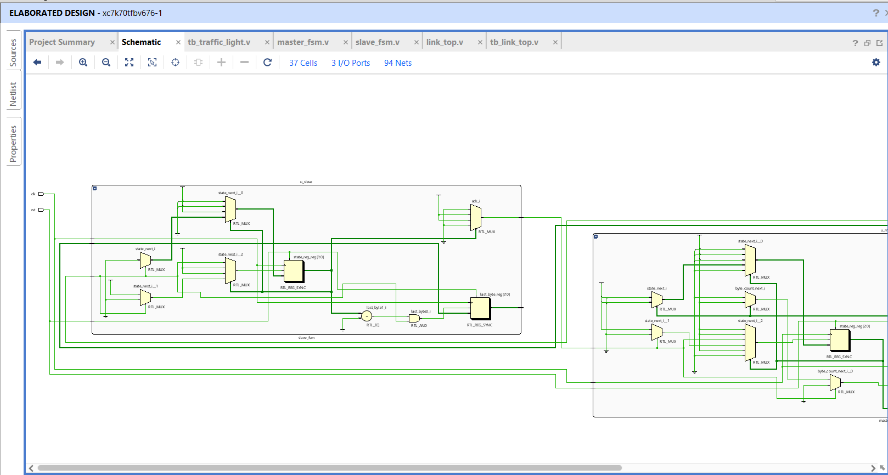
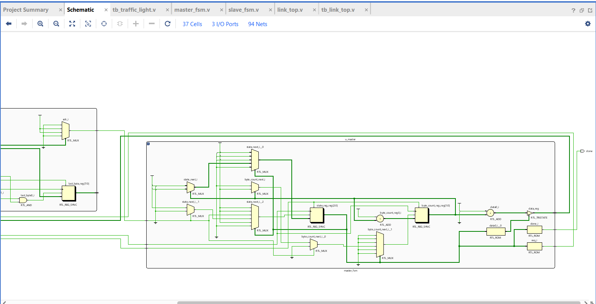
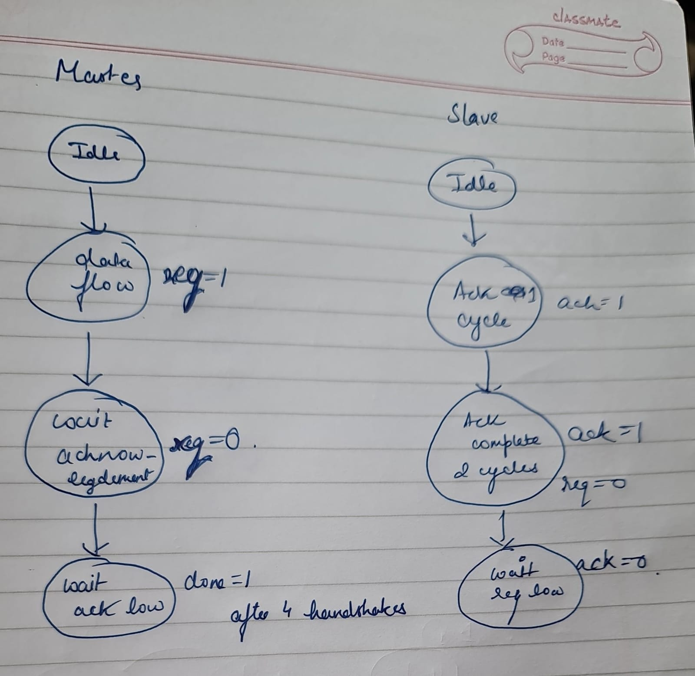
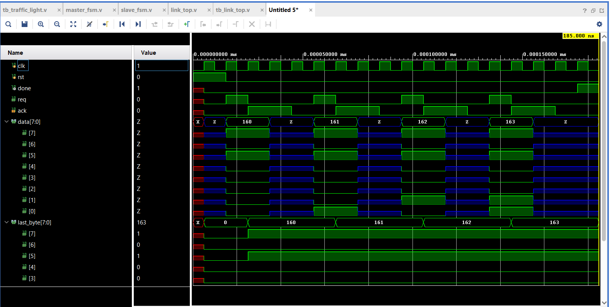

# 🔗 Link Communication FSM (Master–Slave Design)

This project implements a **Link Communication System** using **Finite State Machines (FSMs)** in Verilog.  
The design models a **Master–Slave handshake protocol**, where the **Master FSM** initiates communication and the **Slave FSM** responds accordingly.  

---

## 🛠 Features
- **Master FSM** and **Slave FSM** designed as separate modules (`master_fsm.v`, `slave_fsm.v`).  
- **Top-level module** (`link_top.v`) integrates the FSMs.  
- **Testbench** (`tb_link_top.v`) verifies correct handshake communication.  
- Implements **request–acknowledge protocol** for reliable data transfer.  
- **Synchronous reset** supported.  
- Includes **simulation waveforms** and **design diagrams**.  

---

## ⚙️ FSM Design
### Master FSM:
- Initiates communication by sending **REQ**.  
- Waits for acknowledgment from Slave.  
- Returns to Idle after handshake completes.  

### Slave FSM:
- Monitors for **REQ** signal.  
- Sends **ACK** when request is received.  
- Ensures proper synchronization with Master before returning to Idle.  

---

## 📊 Block & State Diagrams
- **Block Diagram** (System-level view):  
    
    

- **FSM State Diagram**:  
    

---

## 📈 Example Waveform
- Demonstrates the **REQ–ACK handshake**.  
- Master initiates request → Slave acknowledges → Handshake completes.  

  

---

## 🚀 How to Run
1. Open the project in any Verilog simulator (ModelSim, Xilinx Vivado, Icarus Verilog, etc.).  
2. Compile all source files:  
   ```
   link_top.v
   master_fsm.v
   slave_fsm.v
   tb_link_top.v
   ```
3. Run the testbench (`tb_link_top.v`).  
4. Observe the simulated **REQ–ACK signals** in the waveform viewer.  


